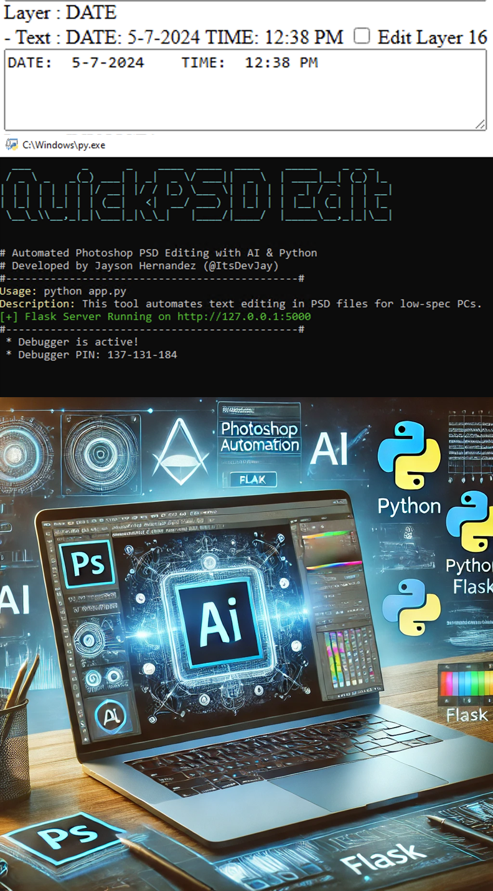

QuickPSD Edit 🎨⚡

Automate PSD editing with AI-powered scripting in Python & Flask

QuickPSD Edit is a Python-based automation tool that streamlines the modification of Photoshop PSD templates using AI and scripting. By integrating Flask and win32com, this project dynamically updates text, images, and design elements based on user inputs, significantly reducing the time required for manual edits.

Key Features:

✅ Automated PSD Editing – Modify text, images, and design elements programmatically.

✅ AI-Driven Efficiency – Uses automation to speed up the design workflow and maintain consistency.

✅ Flask-Powered API – Handles dynamic user inputs and updates PSD files in real-time.

✅ Photoshop Integration – Utilizes win32com to interact with Photoshop seamlessly.

✅ Optimized for Designers – Helps graphic designers and marketers generate personalized graphics quickly.

Tech Stack
Python (Flask, win32com)
Adobe Photoshop API (via win32com)
AI & Automation

Why Use QuickPSD Edit?
This project showcases how AI-enhanced scripting can boost productivity in creative fields by eliminating repetitive tasks, allowing users to create customized designs with minimal effort.

💡 Future Enhancements: Planning to expand with additional AI features for image recognition, smart layout adjustments, and cloud-based processing.
